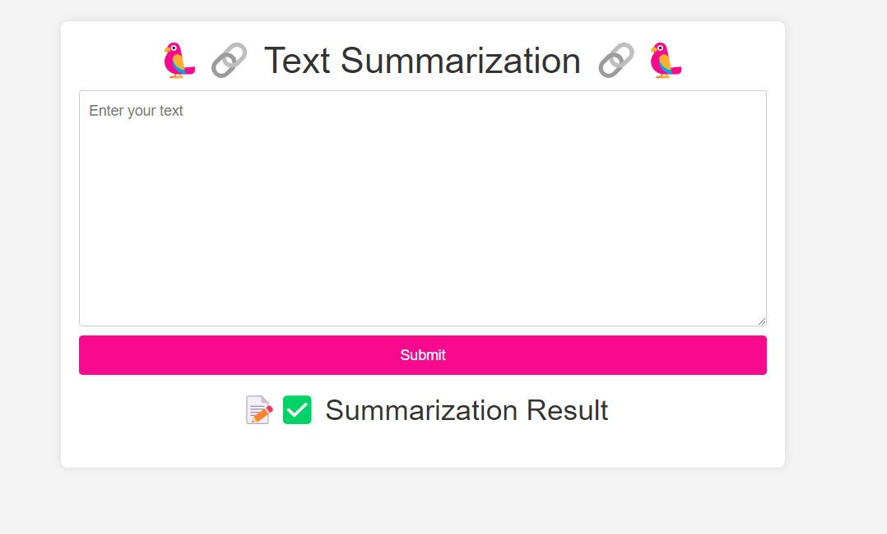

# Text Summarization Web App using Flask and LLM

This project is a web application developed using the Flask framework. It allows users to summarize text inputs. The summarization process employs a Language Learning Model (LLM), specifically the llama-2-7b-chat.ggmlv3.q8_0.bin model.


## Installation

```bash
  pip install -r requirements.txt
```
    
## Usage/Examples

```javascript
python app.py
```

